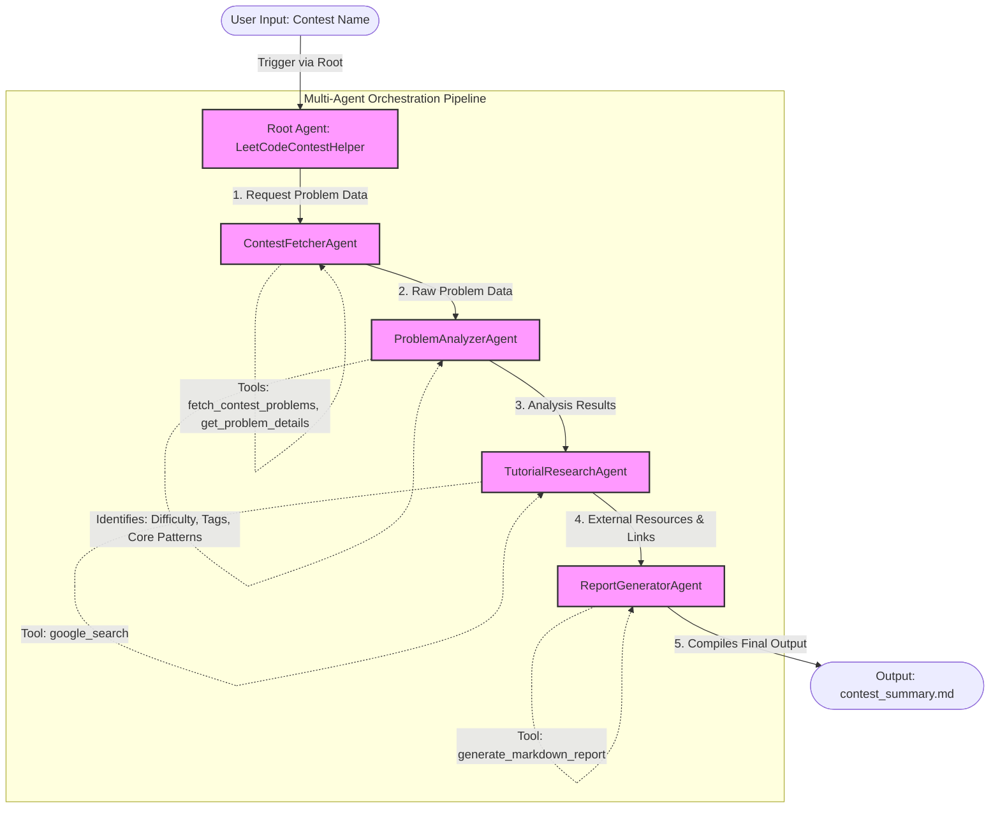

# 🚀 LeetCode Contest Helper - Approach & Workflow

## 📖 Overview
The **LeetCode Contest Helper** is an automated multi-agent system powered by the **Google Agent Development Kit (ADK)** and **Gemini 1.5 Flash**. Its core purpose is to retrieve LeetCode contest problems, analyze them for structural patterns and difficulties, fetch top-tier tutorials via Google Search, and output a detailed Markdown summary for users.

## 🏗 System Architecture & Approach

This project strictly follows a **Sequential Agent Orchestration Pattern**, where specialized sub-agents perform targeted tasks in a chained pipeline overseen by a Root Agent.

### Step-by-Step Approach:
1. **User Input Handling**: The user provides a specific LeetCode contest name (e.g., "Weekly Contest 350").
2. **Data Extraction**: The `ContestFetcherAgent` uses custom tools (`fetch_contest_problems`, `get_problem_details`) to retrieve the contest's problem descriptions, constraints, and raw metadata.
3. **Problem Analysis**: The `ProblemAnalyzerAgent` takes the extracted problems, classifies their difficulty, and maps them to technical patterns (e.g., Dynamic Programming, Graph, Sliding Window).
4. **Learning Resource Discovery**: The `TutorialResearchAgent` utilizes the built-in `google_search` tool to find high-quality educational resources, tutorials, and alternative explanations from the web.
5. **Report Generation**: Finally, the `ReportGeneratorAgent` compiles the synthesized problem analysis and external tutorials into a well-formatted `contest_summary.md` file using the `generate_markdown_report` tool.

---

## 🗺️ Flow Diagram

---

## 🚀 What to Do Next in the Project?

To properly extend and validate this project, follow these actionable steps:

1. **Environment Initialization**:
   - Install required dependencies via `pip install -r requirements.txt`.
   - Setup the `.env` file with the necessary API keys (like Google Gemini API) because it is git-ignored and crucial for agent inference.

2. **Test The Execution Flow**:
   - Run the root orchestrator (e.g., `agent.py`) by inputting a sample known LeetCode contest.
   - **Verification**: Check if `contest_summary.md` generates without errors and contains accurate problem descriptions and related search links.

3. **Enhance Tool Logic**:
   - Validate that `ContestFetcherAgent` correctly resolves queries. If scraping fails due to LeetCode UI changes, consider porting `fetch_contest_problems` to use LeetCode's undocumented GraphQL API for enhanced reliability.
   - Refine the instructions of the `TutorialResearchAgent` to only prioritize high-quality platforms (like YouTube, GeeksForGeeks, or specific LeetCode discussion forums) during its `google_search`.

4. **Future Iterations**:
   - **Solution Code Sub-agent**: Integrate another sub-agent that drafts base solution templates (in Python, C++, Java) for the output report.
   - **Error Handling Pipeline**: Incorporate self-reflection/error-handling so if the report fails to find a tutorial, it falls back to Gemini's internal knowledge base to write one from scratch.
